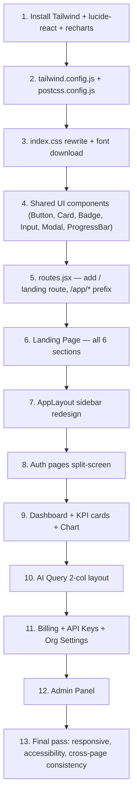

# UI Redesign Plan — Hapy (AI SaaS Platform)
> **Status: FINALIZED — Awaiting Approval to Execute**

This plan transforms the current functional test UI into a polished, production-ready SaaS product. It introduces a brand-new public **Landing Page**, a full **Tailwind CSS migration**, a **dark sidebar layout**, redesigned **auth pages**, and polished versions of all existing app screens.

---

## ✅ All Design Decisions Resolved

| Decision | Choice |
|---|---|
| Product name | **Hapy** |
| Display / heading font | **Cabinet Grotesk** |
| Body / UI font | **Inter** |
| Logo | **Wordmark only** (text-based) |
| Primary accent color | **`#b2c147`** (lime/olive) |
| Base / sidebar color | **`#292929`** (near-black) |
| Background | **White** |
| Route for Landing | **`/`** — public landing; authenticated users redirect to `/dashboard` |
| Animations | **CSS-only** now; framer-motion later |
| Testimonials | **Not included** in v1 |

---

## User Review Required

> [!IMPORTANT]
> This plan involves a **Tailwind CSS migration**. All current inline `style={}` and the `index.css` utility classes (`.grid-2`, `.card`, `.btn-primary`, etc.) will be replaced with Tailwind utility classes. The CSS rewrite is **complete** — no styles will be lost, only modernized.

> [!WARNING]
> **Cabinet Grotesk** is not on Google Fonts. It will be self-hosted from [Fontshare](https://www.fontshare.com/fonts/cabinet-grotesk) (free for commercial use). A `@font-face` block will be added in `index.css`. This requires downloading the font file once.

> [!NOTE]
> The landing page at `/` will be visible to **everyone** (no auth required). Logged-in users hitting `/` are redirected to `/dashboard`. This requires a small change to the root route in `routes.jsx`.

---

## Proposed Changes

---

### Layer 0 — Dependencies & Configuration

#### [NEW] `tailwind.config.js`
```js
/** @type {import('tailwindcss').Config} */
export default {
  content: ['./index.html', './src/**/*.{js,jsx,ts,tsx}'],
  theme: {
    extend: {
      colors: {
        brand: {
          dark:  '#292929',
          lime:  '#b2c147',
          lime10: '#f5f7e1',  // 10% lime tint for hover backgrounds
        },
      },
      fontFamily: {
        display: ['"Cabinet Grotesk"', 'Inter', 'sans-serif'],
        sans:    ['Inter', 'system-ui', 'sans-serif'],
        mono:    ['"JetBrains Mono"', 'monospace'],
      },
      boxShadow: {
        card: '0 1px 4px rgba(0,0,0,0.06), 0 0 0 1px rgba(0,0,0,0.04)',
      },
    },
  },
  plugins: [],
}
```

#### [MODIFY] `postcss.config.js` (NEW if not present)
```js
export default {
  plugins: { tailwindcss: {}, autoprefixer: {} },
}
```

#### [MODIFY] `src/index.css`
Complete rewrite:
```css
/* Cabinet Grotesk — self-hosted from Fontshare */
@font-face {
  font-family: 'Cabinet Grotesk';
  src: url('/fonts/CabinetGrotesk-Variable.woff2') format('woff2');
  font-weight: 100 900;
  font-display: swap;
}

@tailwind base;
@tailwind components;
@tailwind utilities;

@layer base {
  html { @apply antialiased; }
  body { @apply font-sans text-brand-dark bg-white; }
}

/* CSS-only scroll animation utilities */
@layer utilities {
  .animate-fade-up {
    animation: fadeUp 0.6s ease both;
  }
  .animate-fade-in {
    animation: fadeIn 0.5s ease both;
  }
  @keyframes fadeUp {
    from { opacity: 0; transform: translateY(20px); }
    to   { opacity: 1; transform: translateY(0); }
  }
  @keyframes fadeIn {
    from { opacity: 0; }
    to   { opacity: 1; }
  }
}
```

#### Install command
```bash
cd frontend
npm install -D tailwindcss postcss autoprefixer
npx tailwindcss init -p
```
Font file will be placed at `frontend/public/fonts/CabinetGrotesk-Variable.woff2`.

---

### Layer 1 — Routing

#### [MODIFY] `src/routes.jsx`

Key change: `/` now renders `<LandingPage>` for unauthenticated users. Authenticated users are redirected to `/dashboard`.

```diff
+ import { LandingPage } from './pages/landing/LandingPage';

  export const AppRoutes = () => {
    return (
      <Routes>
+       {/* Public Landing */}
+       <Route
+         path="/"
+         element={
+           <PublicOnlyRoute redirectTo="/dashboard">
+             <LandingPage />
+           </PublicOnlyRoute>
+         }
+       />

        {/* Auth Routes */}
        <Route path="/login"    element={<PublicOnlyRoute><LoginPage /></PublicOnlyRoute>} />
        <Route path="/register" element={<PublicOnlyRoute><RegisterPage /></PublicOnlyRoute>} />
        <Route path="/password-reset" element={<PasswordResetPage />} />
        <Route path="/verify/:token"  element={<VerifyEmailPage />} />

        {/* Protected App under AppLayout */}
        <Route
          path="/app"          ← wrapping path changed from "/" to "/app"
          element={<ProtectedRoute><AppLayout /></ProtectedRoute>}
        >
          <Route index element={<Navigate to="/app/dashboard" replace />} />
          <Route path="dashboard" element={<DashboardPage />} />
          <Route path="ai"        element={<AIQueryPage />} />
          <Route path="billing"   element={<BillingPage />} />
          <Route path="keys"      element={<APIKeysPage />} />
          <Route path="settings"  element={<OrganizationSettingsPage />} />
          <Route path="admin"     element={<AdminRoute><AdminPage /></AdminRoute>} />
        </Route>

-       <Route path="*" element={<Navigate to="/dashboard" replace />} />
+       <Route path="*" element={<Navigate to="/" replace />} />
      </Routes>
    );
  };
```

> [!NOTE]
> Internal app links change from `/dashboard` → `/app/dashboard`, `/ai` → `/app/ai`, etc. All `NavLink` and `navigate()` calls in the app will be updated accordingly.

---

### Layer 2 — Design System (Shared UI Components)

New shared components that all pages use. These replace the ad-hoc inline styles.

#### [NEW] `src/components/ui/Button.jsx`
```jsx
// variants: 'primary' | 'secondary' | 'ghost' | 'danger' | 'dark'
// sizes: 'sm' | 'md' | 'lg'
export const Button = ({ variant = 'primary', size = 'md', children, ...props }) => {
  const base = 'inline-flex items-center justify-center font-semibold rounded-lg transition-all duration-150 focus:outline-none focus:ring-2 focus:ring-offset-2 disabled:opacity-50 disabled:cursor-not-allowed';
  const variants = {
    primary:   'bg-brand-lime text-brand-dark hover:brightness-110 focus:ring-brand-lime',
    secondary: 'bg-white border border-gray-200 text-brand-dark hover:bg-gray-50 focus:ring-gray-300',
    ghost:     'text-brand-dark hover:bg-gray-100 focus:ring-gray-200',
    danger:    'bg-red-50 border border-red-200 text-red-700 hover:bg-red-100 focus:ring-red-300',
    dark:      'bg-brand-dark text-white hover:bg-gray-800 focus:ring-brand-dark',
  };
  const sizes = { sm: 'px-3 py-1.5 text-sm', md: 'px-4 py-2 text-sm', lg: 'px-6 py-3 text-base' };
  return <button className={`${base} ${variants[variant]} ${sizes[size]}`} {...props}>{children}</button>;
};
```

#### [NEW] `src/components/ui/Card.jsx`
```jsx
// variants: 'default' | 'dark' | 'bordered'
export const Card = ({ variant = 'default', className = '', children }) => {
  const variants = {
    default:  'bg-white shadow-card rounded-xl p-6',
    dark:     'bg-brand-dark text-white rounded-xl p-6',
    bordered: 'bg-white border border-gray-200 rounded-xl p-6',
  };
  return <div className={`${variants[variant]} ${className}`}>{children}</div>;
};
```

#### [NEW] `src/components/ui/Badge.jsx`
```jsx
// variants: 'lime' | 'gray' | 'red' | 'green' | 'dark'
export const Badge = ({ variant = 'gray', children }) => {
  const variants = {
    lime:  'bg-brand-lime/20 text-brand-dark border border-brand-lime/40',
    gray:  'bg-gray-100 text-gray-600 border border-gray-200',
    red:   'bg-red-50 text-red-700 border border-red-200',
    green: 'bg-green-50 text-green-700 border border-green-200',
    dark:  'bg-brand-dark text-white',
  };
  return <span className={`inline-flex items-center px-2.5 py-0.5 rounded-full text-xs font-semibold ${variants[variant]}`}>{children}</span>;
};
```

#### [NEW] `src/components/ui/Input.jsx`
```jsx
export const Input = ({ label, error, ...props }) => (
  <div className="flex flex-col gap-1.5">
    {label && <label className="text-sm font-semibold text-brand-dark">{label}</label>}
    <input
      className="w-full px-3 py-2 border border-gray-200 rounded-lg text-sm bg-white placeholder-gray-400
                 focus:outline-none focus:ring-2 focus:ring-brand-lime focus:border-transparent
                 disabled:bg-gray-50 disabled:text-gray-400 read-only:bg-gray-50"
      {...props}
    />
    {error && <p className="text-xs text-red-600">{error}</p>}
  </div>
);
```

#### [NEW] `src/components/ui/ProgressBar.jsx`
```jsx
// Color-adaptive: lime < 60%, yellow 60-80%, red > 80%
export const ProgressBar = ({ value, max, className = '' }) => {
  const pct = Math.min(100, (value / max) * 100);
  const color = pct >= 80 ? 'bg-red-500' : pct >= 60 ? 'bg-yellow-400' : 'bg-brand-lime';
  return (
    <div className={`w-full h-2 bg-gray-100 rounded-full overflow-hidden ${className}`}>
      <div className={`h-full ${color} rounded-full transition-all duration-500`} style={{ width: `${pct}%` }} />
    </div>
  );
};
```

#### [NEW] `src/components/ui/Modal.jsx`
```jsx
// Backdrop blur modal with keyboard close (Escape)
export const Modal = ({ isOpen, onClose, title, children }) => {
  if (!isOpen) return null;
  return (
    <div className="fixed inset-0 z-50 flex items-center justify-center p-4 bg-black/40 backdrop-blur-sm" onClick={onClose}>
      <div className="bg-white rounded-2xl shadow-2xl w-full max-w-md p-6 animate-fade-up" onClick={e => e.stopPropagation()}>
        {title && <h2 className="text-lg font-semibold text-brand-dark mb-4">{title}</h2>}
        {children}
      </div>
    </div>
  );
};
```

---

### Layer 3 — Landing Page

#### [NEW] `src/pages/landing/LandingPage.jsx`
```jsx
import { LandingNavbar }      from '../../components/landing/LandingNavbar';
import { HeroSection }        from '../../components/landing/HeroSection';
import { HowItWorksSection }  from '../../components/landing/HowItWorksSection';
import { FeaturesSection }    from '../../components/landing/FeaturesSection';
import { PricingSection }     from '../../components/landing/PricingSection';
import { FaqSection }         from '../../components/landing/FaqSection';
import { LandingFooter }      from '../../components/landing/LandingFooter';

export const LandingPage = () => (
  <div className="min-h-screen bg-white">
    <LandingNavbar />
    <main>
      <HeroSection />
      <HowItWorksSection />
      <FeaturesSection />
      <PricingSection />
      <FaqSection />
    </main>
    <LandingFooter />
  </div>
);
```

---

#### [NEW] `src/components/landing/LandingNavbar.jsx`

```
┌─────────────────────────────────────────────────────────┐
│  Hapy●        Dashboard  Features  Pricing      Login  [Get Started →]  │
└─────────────────────────────────────────────────────────┘
```

- Sticky top, `backdrop-blur-md bg-white/80 border-b border-gray-100`
- **Hapy** wordmark in `font-display font-bold text-brand-dark`, lime dot `●` as logo mark
- Nav links: Features, Pricing, Docs (scroll to section)
- Right: `Login` (ghost) + `Get Started →` (lime primary button)
- Mobile: Hamburger toggle showing full-screen nav

---

#### [NEW] `src/components/landing/HeroSection.jsx`

```
┌──────────────────────────────────────────────────────────────────┐
│                                                                  │
│   ┌─ AI-Powered Document Intelligence ─┐   ← Eyebrow pill       │
│                                                                  │
│   Complex Documents.                                             │
│   Simple Conversations.           [Documents stack illustration] │
│                                   → → →  [Chat UI mockup]        │
│   Turn lengthy reports into clear                                │
│   answers with AI.                                               │
│                                                                  │
│   [Start for Free →]   [See How It Works]                        │
│                                                                  │
│   ──── Trusted by teams at ──── [logo row placeholder] ────      │
└──────────────────────────────────────────────────────────────────┘
```

**Implementation details:**
```jsx
// Background: faint lime radial gradient behind the split visual
<section className="relative overflow-hidden pt-32 pb-20 px-6">
  {/* bg blob */}
  <div className="absolute top-0 right-0 w-[600px] h-[600px] rounded-full bg-brand-lime/8 blur-3xl -z-10" />

  <div className="max-w-7xl mx-auto grid lg:grid-cols-2 gap-16 items-center">
    {/* Text side */}
    <div className="animate-fade-up">
      {/* Eyebrow pill */}
      <span className="inline-flex items-center gap-1.5 px-3 py-1 rounded-full bg-brand-lime/15 text-brand-dark text-sm font-semibold mb-6">
        <span className="w-1.5 h-1.5 rounded-full bg-brand-lime" />
        AI-Powered Document Intelligence
      </span>

      <h1 className="font-display text-6xl lg:text-7xl font-bold text-brand-dark leading-[1.05] mb-6">
        Complex Documents.<br />
        <span className="text-brand-lime">Simple</span> Conversations.
      </h1>

      <p className="text-lg text-gray-500 max-w-lg mb-10 leading-relaxed">
        Turn lengthy reports, research papers, and business documents into
        clear answers with AI. Your knowledge, finally within reach.
      </p>

      <div className="flex flex-wrap gap-3">
        <Button variant="primary" size="lg" asLink to="/register">
          Start for Free →
        </Button>
        <Button variant="secondary" size="lg" scrollTo="how-it-works">
          See How It Works
        </Button>
      </div>
    </div>

    {/* Visual side — CSS illustration */}
    <div className="relative animate-fade-in hidden lg:block">
      {/* Document stack (staggered cards) */}
      <DocumentsIllustration />
      {/* Connecting SVG arrow lines */}
      <FlowArrows />
      {/* Chat UI mockup card */}
      <ChatMockup />
    </div>
  </div>
</section>
```

**Visual components (pure CSS/SVG):**
- `DocumentsIllustration`: 3 overlapping document-silhouette cards, rotated slightly, filled with subtle text-line patterns
- `FlowArrows`: SVG `<path>` with dashed stroke-dasharray animated CSS `stroke-dashoffset`
- `ChatMockup`: White rounded card showing 2 chat bubbles (one dark, one lime)

---

#### [NEW] `src/components/landing/HowItWorksSection.jsx`

```
┌─────────────────────────────────────────────────────┐
│           How It Works                              │
│                                                     │
│  ┌────────┐   ──▶   ┌────────┐   ──▶  ┌────────┐  │
│  │ 01     │         │ 02     │         │ 03     │  │
│  │        │         │        │         │        │  │
│  │ Upload │         │  Ask   │         │  Get   │  │
│  │ your   │         │ in     │         │ clear  │  │
│  │ docs   │         │ plain  │         │ answers│  │
│  │        │         │ English│         │        │  │
│  └────────┘         └────────┘         └────────┘  │
└─────────────────────────────────────────────────────┘
```

```jsx
const steps = [
  { num: '01', title: 'Upload Your Documents', desc: 'Add PDFs, Word docs, research papers — any text-based knowledge your team needs.' },
  { num: '02', title: 'Ask in Plain English', desc: 'Type your question naturally. No special syntax, no search queries, just conversation.' },
  { num: '03', title: 'Get Clear Answers', desc: 'Receive cited, grounded responses from your actual documents — not hallucinations.' },
];
// Section bg: bg-gray-50
// Step cards: white, rounded-xl, shadow-card
// Number pill: font-display text-4xl font-bold text-brand-lime/30 (large, decorative)
// Connectors: hidden md:block — horizontal dashed line SVG between cards
```

---

#### [NEW] `src/components/landing/FeaturesSection.jsx`

6 feature cards, 3×2 grid on desktop, 1-col on mobile:

| # | Icon (Lucide) | Title | Subtitle |
|---|---|---|---|
| 1 | `FileText` | RAG Knowledge Base | Upload docs, get cited answers |
| 2 | `Zap` | Semantic Caching | 62%+ cache hit rate, near-zero latency |
| 3 | `Shuffle` | Multi-Model Routing | Auto-fallback across Gemini models |
| 4 | `BarChart2` | Usage Analytics | Real-time request, token & cost tracking |
| 5 | `Users` | Team & Roles | Owner → Admin → Member → Viewer |
| 6 | `Key` | API Access | REST API with org-scoped keys |

```jsx
// Card hover: border-brand-lime shadow-md transition-all duration-200
// Section headline: "Understand More. Search Less."
// Subheadline: gray-500
// Icon container: bg-brand-lime/10 rounded-lg p-3, icon in brand-dark
```

---

#### [NEW] `src/components/landing/PricingSection.jsx`

```
        ┌────────────────────────────────────────────────┐
        │   Simple, Transparent Pricing                  │
        │   [Monthly] [Annual — save 20%]                │
        └────────────────────────────────────────────────┘

┌──────────────┐   ┌──────────────────────┐   ┌──────────────┐
│     Free     │   │        Pro  ★        │   │  Enterprise  │
│              │   │  (lime border ring)  │   │              │
│    $0/mo     │   │      $29/mo          │   │    $99/mo    │
│              │   │                      │   │              │
│ • 100 req    │   │ • 1,000 req          │   │ • 999,999    │
│ • 1h cache   │   │ • 24h cache          │   │ • 168h cache │
│ • RAG        │   │ • RAG                │   │ • RAG        │
│              │   │ • Priority support   │   │ • Custom SLA │
│ [Get Started]│   │     [Get Pro]        │   │ [Contact Us] │
└──────────────┘   └──────────────────────┘   └──────────────┘
```

- Data fetched from `/api/billing/plans/` (reuses existing `billingService`)
- Pro card: `ring-2 ring-brand-lime` + "Most Popular" badge
- Monthly/Annual toggle: CSS-only pill toggle
- Annual prices: 20% discount calculated on frontend

---

#### [NEW] `src/components/landing/FaqSection.jsx`

CSS-only accordion (checkbox hack or `<details>`/`<summary>` HTML):

```jsx
const faqs = [
  { q: 'What is RAG and how does Hapy use it?', a: '...' },
  { q: 'Is my organization\'s data private?', a: '...' },
  { q: 'Can I switch plans at any time?', a: '...' },
  { q: 'How does semantic caching save me money?', a: '...' },
  { q: 'What AI models does Hapy use?', a: '...' },
  { q: 'Is there a free trial?', a: '...' },
];
// Uses <details> + <summary> — native CSS open/close, no JS needed
// Animated with CSS max-height transition
// Border-bottom separator between items
```

---

#### [NEW] `src/components/landing/LandingFooter.jsx`

```
┌──────────────────────────────────────────────────────┐
│  Hapy●                    Product    Company   Legal  │
│  The AI platform that     Dashboard  About     Privacy│
│  reads your documents     AI Query   Blog      Terms  │
│  for you.                 Billing    Contact          │
│                           API Keys                    │
│  ─────────────────────────────────────────────────   │
│  © 2026 Hapy. All rights reserved.     [Twitter] [GH] │
└──────────────────────────────────────────────────────┘
```

- Background: `bg-brand-dark text-white`
- Logo: white wordmark
- Links: `text-gray-400 hover:text-white`

---

### Layer 4 — App Layout (Sidebar Redesign)

#### [MODIFY] `src/components/layout/AppLayout.jsx`

**Visual diff — sidebar:**

```
BEFORE                          AFTER
──────────────────────────      ─────────────────────────────
bg: #f9f9f9 (light gray)        bg: #292929 (brand-dark)
text: #222 (dark)               text: white
border: 1px solid #ccc          border: none
emojis as icons                 Lucide React icons
active: bg #e8e8e8              active: 3px lime left border +
                                        text-brand-lime
no hover effect                 hover: bg-white/5
badges: blue tint               badges: lime pill (plan) +
                                        gray pill (role)
user section: plain text        user section: avatar initials
logout: plain button            logout: ghost red-hover button
```

**New sidebar structure (Tailwind):**
```jsx
<aside className="w-60 min-h-screen bg-brand-dark flex flex-col">
  {/* Logo */}
  <div className="px-5 py-6 border-b border-white/10">
    <span className="font-display text-xl font-bold text-white">
      Hapy<span className="text-brand-lime">●</span>
    </span>
    {/* Org info */}
    <div className="mt-3 text-sm text-gray-400">
      {organization?.name}
      <div className="flex gap-2 mt-1.5">
        <Badge variant="lime">{planName}</Badge>
        <Badge variant="gray">{role}</Badge>
      </div>
    </div>
  </div>

  {/* Nav */}
  <nav className="flex-1 px-3 py-4 space-y-0.5">
    {navItems.map(({ to, icon: Icon, label }) => (
      <NavLink key={to} to={to} className={({ isActive }) =>
        `flex items-center gap-3 px-3 py-2.5 rounded-lg text-sm font-medium transition-all
         ${isActive
           ? 'text-brand-lime bg-white/5 border-l-2 border-brand-lime pl-[10px]'
           : 'text-gray-400 hover:text-white hover:bg-white/5'}`
      }>
        <Icon size={16} />
        {label}
      </NavLink>
    ))}
  </nav>

  {/* User / Logout */}
  <div className="px-3 py-4 border-t border-white/10">
    <div className="flex items-center gap-3 px-3 py-2 rounded-lg mb-1">
      {/* Avatar initials circle */}
      <div className="w-7 h-7 rounded-full bg-brand-lime flex items-center justify-center text-xs font-bold text-brand-dark">
        {user?.email?.[0]?.toUpperCase()}
      </div>
      <span className="text-xs text-gray-400 truncate">{user?.email}</span>
    </div>
    <Button variant="ghost" size="sm" onClick={handleLogout}
      className="w-full text-gray-400 hover:text-red-400 hover:bg-red-400/10">
      Sign out
    </Button>
  </div>
</aside>
```

**Nav items (with Lucide icons):**
```js
import { LayoutDashboard, BrainCircuit, CreditCard, Key, Settings, ShieldAlert } from 'lucide-react';

const navItems = [
  { to: '/app/dashboard', icon: LayoutDashboard, label: 'Dashboard' },
  { to: '/app/ai',        icon: BrainCircuit,    label: 'AI Query & RAG' },
  { to: '/app/billing',   icon: CreditCard,      label: 'Billing & Usage' },
  { to: '/app/keys',      icon: Key,             label: 'API Keys' },
  { to: '/app/settings',  icon: Settings,        label: 'Org Settings' },
  // admin only:
  { to: '/app/admin',     icon: ShieldAlert,     label: 'Admin Panel' },
];
```

> [!NOTE]
> Install: `npm install lucide-react`

---

### Layer 5 — Auth Pages

#### [MODIFY] `src/pages/auth/LoginPage.jsx` & `RegisterPage.jsx`

**New layout — Split Screen:**

```
┌─────────────────────┬──────────────────────────┐
│  bg-brand-dark      │  bg-white                │
│                     │                          │
│  Hapy●              │       Sign In            │
│                     │                          │
│  "The best insights │  Email                   │
│  shouldn't be       │  ┌──────────────────────┐│
│  buried under       │  │                      ││
│  hundreds of pages."│  └──────────────────────┘│
│                     │  Password                │
│  — decorative lime  │  ┌──────────────────────┐│
│    accent shapes    │  │                      ││
│                     │  └──────────────────────┘│
│                     │                          │
│                     │  [Sign In →]             │
│                     │  Forgot password?        │
│                     │  Don't have an account?  │
│                     │  Register                │
└─────────────────────┴──────────────────────────┘
```

```jsx
// Left panel: bg-brand-dark, min-h-screen hidden lg:flex
// Right panel: flex-1 flex items-center justify-center
// Form max-w: max-w-sm
// Input focus: ring-brand-lime
// Button: variant="primary" full-width
// Decorative: 2–3 lime/white circle shapes (CSS, absolute positioned)
```

---

### Layer 6 — Dashboard Page

#### [MODIFY] `src/pages/dashboard/DashboardPage.jsx`
#### [MODIFY] `src/components/dashboard/KpiCard.jsx`
#### [MODIFY] `src/components/dashboard/UsageChart.jsx`
#### [MODIFY] `src/components/dashboard/QuickActions.jsx`

**KPI Cards:**
```jsx
// KpiCard redesign
<Card variant="bordered" className="relative overflow-hidden">
  {/* Subtle lime accent line at top */}
  <div className="absolute top-0 left-0 right-0 h-0.5 bg-brand-lime" />
  <p className="text-xs font-semibold text-gray-500 uppercase tracking-wide">{title}</p>
  <p className="text-3xl font-bold font-display text-brand-dark mt-1">{value}</p>
  {progress !== undefined && <ProgressBar value={progress.used} max={progress.max} className="mt-3" />}
  <p className="text-xs text-gray-400 mt-1.5">{subtitle}</p>
  {badge && <Badge variant="red" className="mt-2">{badge}</Badge>}
</Card>
```

**Quick Actions widget:**
```jsx
// Dark card
<Card variant="dark">
  <h3 className="text-white font-semibold mb-3">Quick AI Query</h3>
  <textarea className="w-full bg-white/5 border border-white/10 rounded-lg text-white
                       placeholder-gray-500 p-3 text-sm focus:ring-2 focus:ring-brand-lime
                       focus:border-transparent resize-none" rows={3} />
  <Button variant="primary" size="md" className="mt-3">Send Query →</Button>
</Card>
```

**Usage Chart:**
- Install `recharts` (`npm install recharts`)
- `<AreaChart>` with lime stroke `#b2c147`, fill with 15% opacity gradient
- White bg, no harsh grid lines (only horizontal light lines)

---

### Layer 7 — AI Query Page

#### [MODIFY] `src/pages/ai/AIQueryPage.jsx`

**New 2-column layout (lg screens):**
```
┌────────────────────────────────┬──────────────────────┐
│  Query Input Card              │  Knowledge Base       │
│  (QueryInput component)        │  (DocumentPanel)      │
│                                │  - Upload zone        │
│  Response Card                 │  - Document list      │
│  (ResponseCard — dark bg)      │                       │
│                                │                       │
│  Query History (full width)    │                       │
└────────────────────────────────┴──────────────────────┘
```

Key component changes:
- **ResponseCard**: `Card variant="dark"` — terminal feel (dark bg, white/lime text)
- **Cache HIT badge**: `Badge variant="lime"` | **MISS**: `Badge variant="gray"`
- **DocumentPanel**: Drag-and-drop zone with dashed lime border, `border-2 border-dashed border-brand-lime/40`
- **QueryHistory**: Alternating row bg, `font-mono` for key values (model, cost)

---

### Layer 8 — Billing Page

#### [MODIFY] `src/pages/billing/BillingPage.jsx`

- Usage progress: `ProgressBar` (color-adaptive) with large `%` figure
- Plan cards: same structure as landing pricing, but with functional upgrade buttons
- Semantic cache stats: redesigned KPI-style cards
- Invoices table: alternating rows, `font-mono` for amounts

---

### Layer 9 — API Keys Page

#### [MODIFY] `src/pages/keys/APIKeysPage.jsx`

- Key value: `font-mono`, partially masked
- Copy button: `<Clipboard>` icon, flashes lime on copy (CSS state)
- Revoke: `Button variant="danger"` (small)
- Create: `Button variant="primary"` top-right

---

### Layer 10 — Org Settings Page

#### [MODIFY] `src/pages/settings/OrganizationSettingsPage.jsx`

- Inputs: use new `Input` component
- Member table: avatar initials circle colored by role
- Danger Zone: `Card` with `border-red-200 bg-red-50` — clearly visually separated

---

### Layer 11 — Admin Panel

#### [MODIFY] `src/pages/admin/AdminPage.jsx`

- Top admin banner: `bg-brand-dark text-white` strip saying "Platform Superadmin Console"
- Metrics: large number display with trend `↑` / `↓` indicators
- Health panel: colored indicator dots (green/yellow/red) per service
- Tenant table: filterable, paginated, clean alternating rows

---

## Full File Inventory

```
NEW Files (18):
  src/pages/landing/LandingPage.jsx
  src/components/landing/LandingNavbar.jsx
  src/components/landing/HeroSection.jsx
  src/components/landing/HowItWorksSection.jsx
  src/components/landing/FeaturesSection.jsx
  src/components/landing/PricingSection.jsx
  src/components/landing/FaqSection.jsx
  src/components/landing/LandingFooter.jsx
  src/components/ui/Button.jsx
  src/components/ui/Card.jsx
  src/components/ui/Badge.jsx
  src/components/ui/Input.jsx
  src/components/ui/Modal.jsx
  src/components/ui/ProgressBar.jsx
  public/fonts/CabinetGrotesk-Variable.woff2  (downloaded)
  tailwind.config.js
  postcss.config.js

MODIFY Files (15+):
  src/index.css
  src/routes.jsx
  src/components/layout/AppLayout.jsx
  src/components/auth/LoginForm.jsx
  src/components/auth/RegisterForm.jsx
  src/pages/dashboard/DashboardPage.jsx
  src/components/dashboard/KpiCard.jsx
  src/components/dashboard/UsageChart.jsx
  src/components/dashboard/QuickActions.jsx
  src/pages/ai/AIQueryPage.jsx
  src/components/ai/ResponseCard.jsx
  src/components/ai/DocumentPanel.jsx
  src/components/ai/QueryHistory.jsx
  src/pages/billing/BillingPage.jsx
  src/components/billing/PlanCard.jsx
  src/pages/keys/APIKeysPage.jsx
  src/pages/settings/OrganizationSettingsPage.jsx
  src/pages/admin/AdminPage.jsx
  + remaining auth/billing/keys/admin sub-components
```

---

## Implementation Order (Execution Sequence)



---

## Verification Plan

### Setup Commands
```bash
cd frontend
npm install -D tailwindcss postcss autoprefixer
npm install lucide-react recharts
npx tailwindcss init -p
npm run dev   # verify build works before any UI changes
```

### Manual Verification Checklist

**Landing Page**
- [ ] `/` shows Landing Page for unauthenticated users
- [ ] Authenticated users at `/` redirect to `/app/dashboard`
- [ ] Navbar sticky with blur on scroll
- [ ] Hero split-visual visible on 1280px+ screens
- [ ] How It Works 3-step flow renders
- [ ] Features 6-card grid renders
- [ ] Pricing 3 cards with Pro highlighted
- [ ] FAQ accordion opens/closes correctly (no JS)
- [ ] Footer dark bg, all links work

**Auth**
- [ ] `/login` shows split-screen layout on lg+
- [ ] Login/register forms still submit correctly (no logic changes)

**App Shell**
- [ ] Sidebar dark bg `#292929` renders
- [ ] Active nav item has lime left border
- [ ] Logo wordmark shows `Hapy●`
- [ ] Plan badge (lime) and role badge (gray) visible

**Dashboard**
- [ ] 4 KPI cards with top lime line and progress bars
- [ ] Quick Query widget dark card
- [ ] Recharts AreaChart renders with lime color
- [ ] Refresh Data still works

**All Pages**
- [ ] All existing CRUD functionality works (no logic changes)
- [ ] No regressions: billing upgrade, org settings save, API key create/revoke, admin data load
- [ ] Responsive: sidebar collapses on mobile
- [ ] Fonts load: Cabinet Grotesk for headings, Inter for body

### Build Check
```bash
npm run build   # must exit with no errors
```
